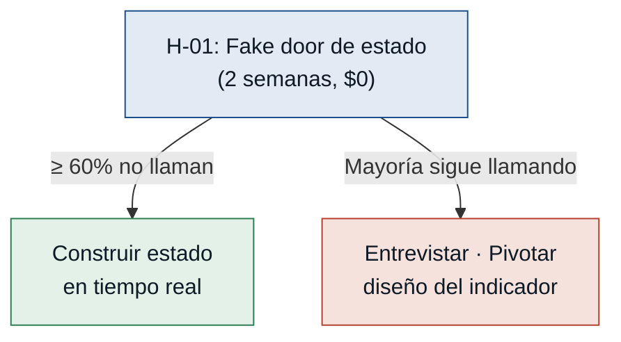
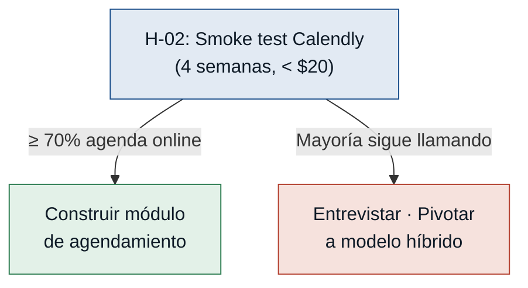
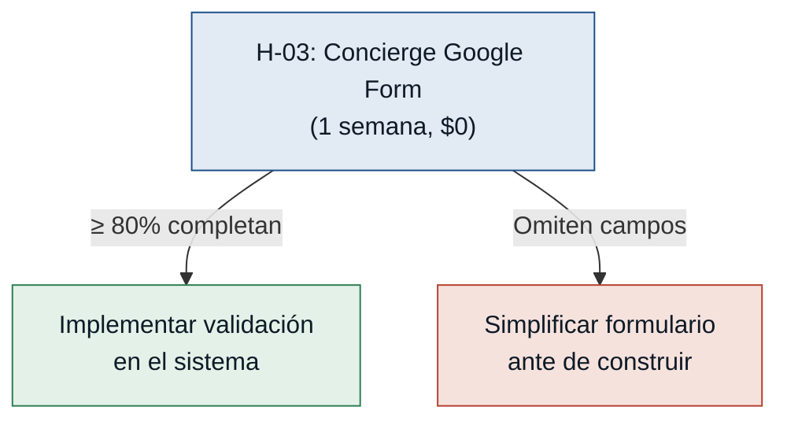
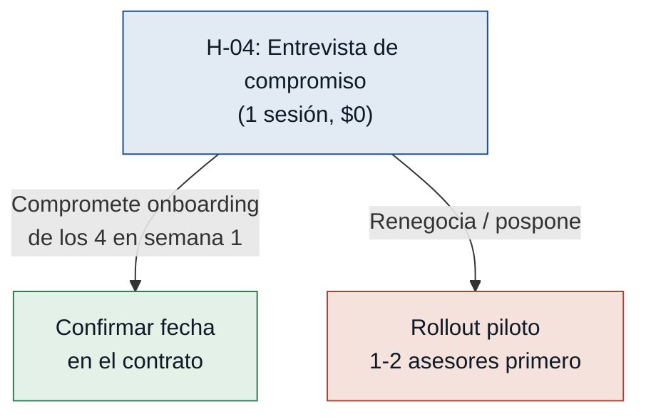

# Hipótesis y experimentos — inmobiliaria-azuay

> Generado por `/discovery:experiments`. Fuente: supuestos del `mvp-canvas.md`.
> Ordenadas de mayor a menor riesgo: se prueba primero lo que más puede tumbar el MVP.

---

## H-01 — Confianza del cliente en el estado en pantalla · riesgo: **alto**

- **Supuesto a probar:** Los clientes confiarán en el estado de propiedad mostrado en pantalla y no llamarán al asesor para confirmar disponibilidad.
- **Hipótesis:** Creemos que el cliente comprador dejará de llamar para confirmar disponibilidad si el portal muestra el estado en tiempo real (disponible / reservada / vendida), porque el dolor principal reportado fue llegar a una propiedad ya reservada sin previo aviso.
- **Señal medible:** Porcentaje de visitas agendadas que no van precedidas de una llamada de confirmación al asesor durante los primeros 30 días.
- **Criterio de éxito:** ≥ 60 % de las visitas agendadas online no van precedidas de llamada de confirmación en los primeros 30 días.
- **Experimento:** Fake door + mago de Oz — mostrar a 10 clientes reales una ficha con estado actualizado manualmente cada 10 minutos por el asesor. Registrar si llaman igualmente para confirmar.
- **Caja de tiempo / costo:** 2 semanas · $0 de desarrollo.
- **Regla de decisión:** Si pasa (≥ 60 % no llaman) → construir el sistema de actualización en tiempo real. Si falla (la mayoría sigue llamando) → entrevistar a quienes llamaron para identificar qué generó desconfianza y pivotar el diseño del indicador de estado antes de construir.

---

## H-02 — Adopción del agendamiento online · riesgo: **alto**

- **Supuesto a probar:** Los clientes preferirán seleccionar el horario de visita desde el portal en lugar de llamar a la inmobiliaria.
- **Hipótesis:** Creemos que el cliente comprador agendará su visita desde el portal sin llamar si puede ver horarios disponibles y confirmar en el momento, porque reportaron que esperar callback de hasta un día fue un dolor clave que generaba desconfianza.
- **Señal medible:** Porcentaje de solicitudes de visita iniciadas desde el portal versus por teléfono durante los primeros 60 días.
- **Criterio de éxito:** ≥ 70 % de las solicitudes de visita se inician desde el portal en los primeros 60 días de operación.
- **Experimento:** Smoke test con mago de Oz — landing page con botón "Agendar visita" que abre un Calendly configurado por el asesor. El asesor confirma manualmente cada reserva. Sin backend propio.
- **Caja de tiempo / costo:** 4 semanas · < $20 (plan básico Calendly).
- **Regla de decisión:** Si pasa (≥ 70 % agenda online) → construir el módulo de agendamiento integrado en el portal. Si falla → entrevistar a quienes llamaron: si el canal telefónico tiene atributos que el portal no replica, pivotar a un modelo híbrido (chat + agenda asistida).

---

## H-03 — Cumplimiento del asesor con la ficha mínima · riesgo: **medio**

- **Supuesto a probar:** Los asesores completarán los campos mínimos obligatorios (metraje, servicios, ≥ 3 fotos) sin intentar eludir la validación del sistema.
- **Hipótesis:** Creemos que el asesor inmobiliario completará los datos mínimos exigidos si el sistema bloquea la publicación de forma explícita, porque ya adoptó de forma natural mejoras de productividad como el código AZU-XXXX cuando el beneficio fue tangible e inmediato.
- **Señal medible:** Porcentaje de propiedades publicadas con todos los campos mínimos completos en el primer intento, sin edición posterior para cumplir requisitos.
- **Criterio de éxito:** ≥ 80 % de las propiedades se publican con campos mínimos completos en el primer intento durante el primer mes.
- **Experimento:** Concierge — entregar a los 4 asesores un formulario Google con los campos mínimos obligatorios y pedirles que carguen 2 propiedades reales cada uno. Observar qué campos intentan omitir y si piden ayuda.
- **Caja de tiempo / costo:** 1 semana · $0.
- **Regla de decisión:** Si pasa (≥ 80 % completan sin omisiones) → implementar la validación de campos en el sistema. Si falla → identificar los campos omitidos con más frecuencia y evaluar si el formulario puede simplificarse antes de construir la validación.

---

## H-04 — Activación completa por la gerente en el primer mes · riesgo: **medio**

- **Supuesto a probar:** La gerente habilitará el sistema para los 4 asesores en el primer mes de operación.
- **Hipótesis:** Creemos que la gerente/propietaria activará el acceso de todos sus asesores en las primeras 4 semanas si el onboarding toma menos de 1 hora por asesor, porque expresó que la plataforma debe ser la cara profesional del negocio, pero que la dificultad de uso es la principal barrera de adopción.
- **Señal medible:** Número de asesores con al menos 1 propiedad publicada al finalizar el primer mes desde el lanzamiento.
- **Criterio de éxito:** Los 4 asesores tienen al menos 1 propiedad publicada a los 30 días del lanzamiento.
- **Experimento:** Entrevista dirigida con la gerente — demostración de onboarding de 30 minutos y pregunta explícita de compromiso para capacitar a los 4 asesores en la semana 1. Registrar si acepta o renegocia el plazo.
- **Caja de tiempo / costo:** 1 sesión · $0.
- **Regla de decisión:** Si pasa (compromete el onboarding de los 4 asesores en semana 1) → confirmar la fecha en el contrato de implementación. Si falla (renegocia o pospone) → replantear el rollout comenzando con 1-2 asesores piloto y escalar cuando el valor sea demostrable.
