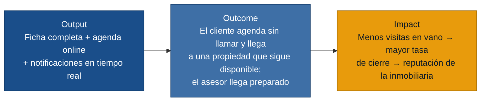

# MVP Canvas — Plataforma inmobiliaria Azuay

> Generado por `/discovery:generate-mvp`. Fuente única: artefactos de `outputs/`.
> El MVP ataca el núcleo de valor: eliminar las visitas en vano y el cuello de botella telefónico.

---

## Cadena de valor: output → outcome → impact

---

## Canvas

| Bloque | Contenido |
|---|---|
| **Propuesta de valor** | Eliminar las visitas en vano y el cuello de botella del teléfono: el cliente sabe en tiempo real si la propiedad está disponible y agenda online; el asesor recibe aviso al instante y llega preparado. |
| **Segmento de usuarios** | Cliente comprador (busca, agenda, decide) · Asesor inmobiliario (publica, atiende, cierra). |
| **Funcionalidades mínimas** | 1. Estado en tiempo real de cada propiedad (disponible / reservada / vendida) con latencia < 60 s (R-05, R-15). 2. Ficha con mínimos obligatorios: metraje, servicios básicos y ≥ 3 fotos de calidad — sin estos datos el sistema no permite publicar (R-08). 3. Agendamiento de visitas desde el portal (calendario con horarios disponibles, sin llamada) (R-07). 4. Notificación push al asesor al confirmarse o cancelarse una visita en su agenda (R-04). 5. Notificación proactiva al cliente si el estado de la propiedad cambia antes de su visita (R-06). |
| **Resultado esperado (outcome)** | El cliente agenda su propia visita sin llamar y llega a una propiedad que sigue disponible. El asesor llega puntual y preparado porque recibió el aviso a tiempo. |
| **Métrica de éxito** | ≥ 70 % de las visitas se agendan desde el portal (sin llamada previa) dentro de los primeros 60 días de uso. |
| **Riesgos / supuestos** | 1. Los asesores cargarán la información mínima exigida (fotos, metraje, servicios) sin eludir la validación del sistema. 2. Los clientes confiarán en el estado en pantalla y no llamarán para confirmar igualmente. 3. La gerente habilitará el sistema para todos sus asesores desde el primer mes de operación. |
| **Fuera de alcance (por ahora)** | Dashboard gerencial de rendimiento por asesor (US-10, US-11, US-12, US-13): el dolor de la gerente es real pero no bloquea la operación diaria; entra en la siguiente iteración. Alertas de bajada de precio y nuevas propiedades por criterios (US-09): agrega valor pero no elimina la fricción núcleo. Rechazo automático de ofertas (US-02): reduce un dolor del asesor pero no impacta al cliente en esta etapa. |

---

## Por qué esta métrica pasa la prueba ácida

La métrica "≥ 70 % de visitas agendadas por portal en 60 días" es de adopción conductual, no de vanidad.
Si sube, la gerente puede decidir: *reducir el tiempo de atención telefónica y reasignarlo a cierre de operaciones*.
Si no sube, el equipo debe investigar por qué los clientes siguen llamando — eso es información de producto, no un número decorativo.

---

## Relación con user stories

| Funcionalidad mínima | User stories |
|---|---|
| Estado en tiempo real | US-05 |
| Ficha con mínimos obligatorios | US-08 |
| Agendamiento online | US-06 |
| Notificación push al asesor | US-04 |
| Notificación proactiva al cliente | US-07 |

---

## Fuera de alcance — detalle

Las funcionalidades descartadas del MVP no son irrelevantes; simplemente no atacan el dolor más compartido entre personas en esta etapa:

- **US-09** (alertas de precio/favoritos): útil para fidelizar al cliente, pero presupone que ya confía en el portal. Se construye sobre la adopción del agendamiento, no antes.
- **US-02** (rechazo automático de ofertas): alivia al asesor, pero el asesor ya tiene el portal y las notificaciones como cambio de fondo de su jornada. Este puede esperar.
- **US-10 a US-13** (herramientas gerenciales): la gerente expresó su dolor claramente (`gerente-propietaria.md`), pero su primera necesidad es que sus asesores y sus clientes usen el sistema — sin adopción operativa, el dashboard es datos vacíos.
