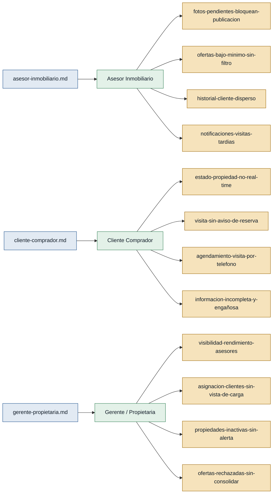

# Personas — inmobiliaria-azuay

> Generado por `/discovery:analyze`. Fuente única: entrevistas en `interviews/`.
> Respaldo **verde** = primera mano · respaldo **ámbar** = referenciada.

---

## Mapa de trazabilidad

---

### P. — Asesor Inmobiliario
- **Contexto:** Agente de ventas que gestiona entre 15 y 20 propiedades activas y la cartera de clientes que gerencia le asigna.
- **Objetivo principal:** Cerrar operaciones (venta/arriendo) sin perder tiempo en tareas administrativas que el sistema debería resolver solo.
- **Dolores:**
  - Cuando el dueño demora en enviar fotos, la propiedad queda inactiva y pierde oportunidades de venta; no puede publicarla con un clic al llegar la imagen. `(asesor-inmobiliario.md)`
  - Recibe ofertas por debajo del mínimo y tiene que rechazarlas manualmente, generando conversaciones incómodas con los clientes. `(asesor-inmobiliario.md)`
  - El historial de cada cliente (visitas, ofertas, consultas) está disperso en distintos lugares del sistema; entra a las reuniones sin contexto. `(asesor-inmobiliario.md)`
  - Se entera tarde de las visitas agendadas porque no revisa el sistema constantemente; necesita una notificación al celular. `(asesor-inmobiliario.md)`
- **Respaldo:** `primera mano` — entrevista propia del rol en `asesor-inmobiliario.md`.

---

### M. — Cliente Comprador
- **Contexto:** Persona que busca comprar o arrendar una propiedad en Cuenca, generalmente sin experiencia previa en el proceso inmobiliario.
- **Objetivo principal:** Encontrar y reservar una propiedad adecuada sin perder tiempo en visitas innecesarias ni depender del teléfono para gestionar cada paso.
- **Dolores:**
  - No sabe en tiempo real si una propiedad está disponible, reservada o vendida; hizo una visita de 40 minutos y la propiedad ya estaba reservada. `(cliente-comprador.md)`
  - Nadie le avisó del cambio de estado antes de la visita; la falta de notificación proactiva genera desconfianza. `(cliente-comprador.md)`
  - Para agendar una visita tiene que llamar, esperar callback y coordinar horarios; tardaban hasta un día en confirmar. `(cliente-comprador.md)`
  - Los avisos omiten metrajes reales, servicios (agua, luz, calle adoquinada) y fotos de calidad; las descripciones son engañosas ("zona tranquila" al lado de un mercado). `(cliente-comprador.md)`
- **Respaldo:** `primera mano` — entrevista propia del rol en `cliente-comprador.md`.

---

### G. — Gerente / Propietaria
- **Contexto:** Directora del negocio; supervisa a cuatro asesores, asigna clientes y toma decisiones sobre precios y estrategia comercial.
- **Objetivo principal:** Tener visibilidad operativa en tiempo real para distribuir la carga de trabajo, detectar problemas antes de que lleguen al cliente y posicionar la plataforma como la cara profesional del negocio.
- **Dolores:**
  - No tiene un resumen claro del rendimiento de cada asesor (visitas realizadas, clientes activos, propiedades sin movimiento). `(gerente-propietaria.md)`
  - Asigna clientes a mano sin ver cuántos clientes activos tiene cada asesor en ese momento. `(gerente-propietaria.md)`
  - Se entera de que una propiedad lleva meses sin actividad solo cuando el dueño ya está enojado; no hay alerta temprana. `(gerente-propietaria.md)`
  - No tiene acceso consolidado al patrón de ofertas rechazadas; esa información le serviría para detectar precios fuera de mercado. `(gerente-propietaria.md)`
- **Respaldo:** `primera mano` — entrevista propia del rol en `gerente-propietaria.md`.

---

## Stakeholders

### Dueño / Propietario de inmueble
- **Interés en el sistema:** Que su propiedad esté publicada y activa lo antes posible, y que las ofertas que le lleguen sean serias (sobre el mínimo pactado).
- **Fuente:** mencionado en `asesor-inmobiliario.md` (demora en fotos) y `gerente-propietaria.md` (dueño enojado por inactividad). **Sin entrevista propia** — respaldo `referenciada`.
